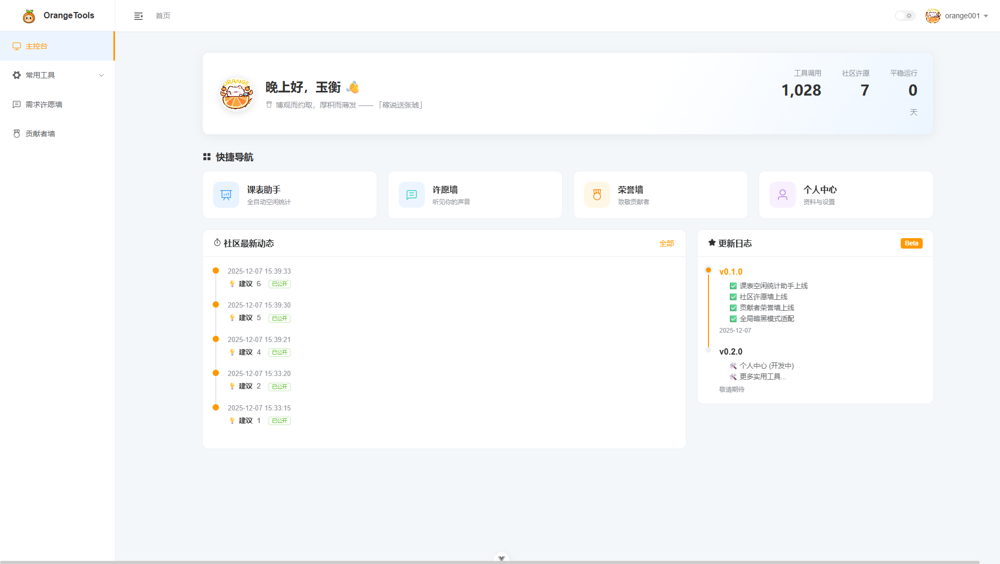
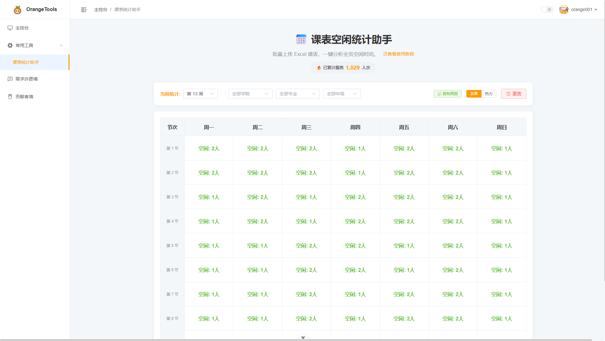
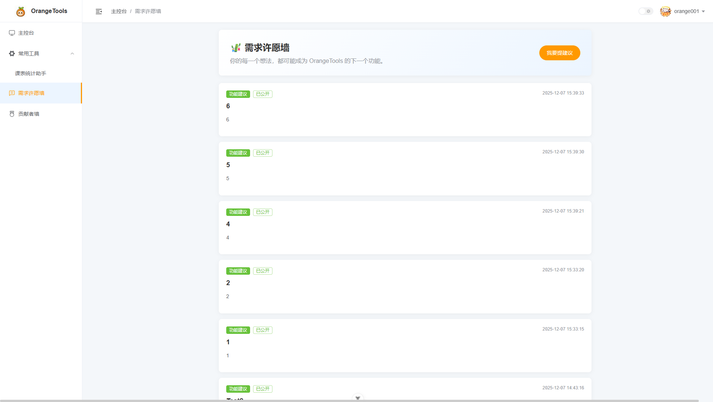
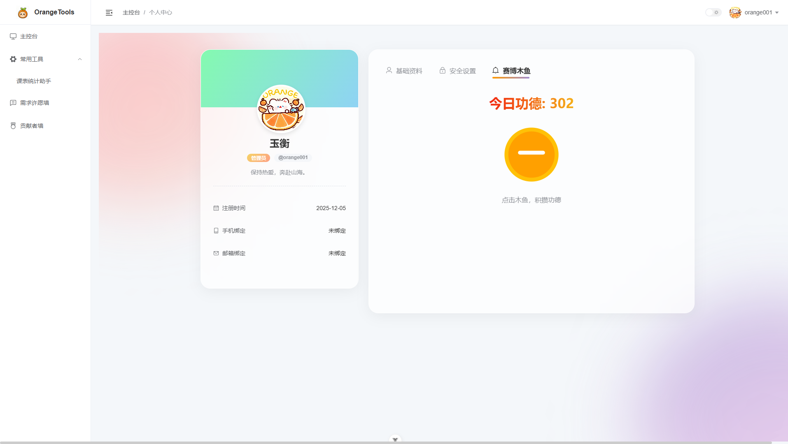

<div align="center">      <h1>🍊 OrangeTools (橙子工具箱)</h1>      <p>     <b>为重庆城市职业学院（城职）学子打造的一站式开源校园工具平台</b>   </p>    <p>     <a href="https://github.com/FangSuYu/OrangeTools/stargazers"></a>     <a href="https://github.com/FangSuYu/OrangeTools/blob/main/LICENSE"></a>                  </p> </div>

---

## 📖 项目简介 | Introduction

**OrangeTools** 是一个前后端分离的开源校园工具平台，采用标准的 **模块化单体 (Modular Monolith)** 架构设计。

它致力于解决校园生活中的痛点（如课表统计等），同时也是计算机专业学生共筑独属于城职开源平台的最佳实践项目。

在线体验：orangetools.cn

> **当前版本**: `v2.3.0` (稳定版+部分测试版)
>
> 当前版本为稳定版，且线上版本已经更新为当前版本。
>
> 该版本相较于以往版本中，主要对课表统计助手新增了更多的信息查看，以及新增了智能排班助手小工具。

---

## ✨ 核心特性 | Features

### 📊 1. 智能主控台 (Dashboard)
- **数据驾驶舱**：集成工具调用量、社区活跃度、系统运行天数等实时数据。
- **每日一言**：接入 Hitokoto 一言接口，每次登录都有新灵感。
- **快捷导航**：卡片式入口，直达核心功能。

### 📅 2. 常用工具 （Common tools）
- **课表空闲统计助手**：批量上传 Excel 课表，一键分析全员空闲时间。
- **智能排班助手**：批量上传 Excel 课表，一键生成智能排班方案，支持手动调整。

### 🎋 3. 社区许愿墙 (Wishlist)
- **极简互动**：用户可提交功能建议或 Bug 反馈，默认公开透明，项目前期的反馈入口。
- **赛博木鱼**：内置趣味减压小工具，敲击积攒功德（含音效与动效）。

### 🏆 4. 贡献者荣誉墙 (Hall of Fame)
- **3D 悬浮卡片**：极客风的视觉交互，卡片跟随鼠标律动。
- **赛博折跃入场**：炫酷的页面加载动画。
- **动态分类**：支持核心团队与社区贡献者的分组展示。

### 👤 5. 个人中心 (User Profile)
- **账号体系**：支持修改资料、绑定学号（唯一性校验）、修改密码。
- **头像管理**：全站统一的头像解析逻辑，支持预设头像切换。
- **UI 设计**：采用毛玻璃（Glassmorphism）风格与流体背景动画。

---

## 📸 界面预览 | Screenshots

| 主控台 (Dashboard) | 课表统计 (Course Tool) |
| :---: | :---: |
|  |  |

| 许愿墙 (Wishlist) | 个人中心 (Profile) |
| :---: | :---: |
|  |  |


---

## 🛠️ 技术栈 | Tech Stack

### 🎨 前端 (Frontend)
| 技术 | 说明                     |
| :--- |:-----------------------|
| **Vue 3.5** | 核心框架 (Composition API) |
| **Vite 7** | 极速构建工具                 |
| **Element Plus** | UI 组件库 (按需加载)          |
| **Pinia** | 状态管理 (含持久化插件)          |
| **VueRouter 4** | 路由管理 (动态标题/权限拦截)       |
| **Sass / CSS Var** | 样式预处理 (支持一键暗黑模式)       |
| **Vue3-Lottie** | login/404/500 页面动画支持   |
| **Vue-CountUp** | 数字滚动特效                 |

### ☕ 后端 (Backend)
| 技术                    | 说明 |
|:----------------------| :--- |
| **Spring Boot 3.5.8** | 核心后端框架 |
| **MyBatis-Plus**      | ORM 框架 (简化 CRUD) |
| **Spring Security**   | 安全认证框架 |
| **JWT**               | 无状态 Token 鉴权 |
| **EasyExcel**         | 阿里开源 Excel 处理库 |
| **MySQL 8.0**         | 关系型数据库 |

---

## 🚀 快速开始 | Quick Start

### 1. 环境准备
* **JDK**: 17+
* **Node.js**: 18+ (强烈推荐 22.14.0 LTS)
* **MySQL**: 8.0+
* **包管理器**: pnpm (强烈推荐)

### 2. 后端启动 (Backend)
```bash
# 1. 进入后端目录
cd backend

# 2. 初始化数据库
# 请在 MySQL 中执行 /backend/sql/init.sql 脚本，创建 orange_tools 库及相关表

# 3. 修改配置
# 将 src/main/resources/application-dev.yml.example 中的数据库账号密码改为你自己的

# 4. 启动项目
mvn spring-boot:run
```

### 3. 前端启动 (Frontend)
```bash
# 1. 进入前端目录
cd frontend

# 2. 安装依赖
pnpm install

# 3. 启动开发服务器
pnpm dev
```
启动成功后，访问：http://localhost:5173

## 📂 目录结构 | Directory Structure
```Plaintext
OrangeTools/
├── backend/                  # 后端工程
│   ├── src/main/java/cn/orangetools/
│   │   ├── common/           # 公共组件 (Result, Exception, Utils)
│   │   ├── system/           # 系统核心 (User, Auth, Security)
│   │   └── modules/          # 业务模块 (插件式开发)
│   │       ├── community/    # 社区模块 (许愿墙, 荣誉墙)
│   │       └── course/       # 课表模块 (EasyExcel解析)
│   │       └── scheduler/    # 排班模块 （工厂策略模式）
│   └── src/main/resources/   # 配置文件
├── frontend/                 # 前端工程
│   ├── src/
│   │   ├── api/              # API 接口管理
│   │   ├── assets/           # 静态资源 (头像, Logo, Lottie)
│   │   ├── layout/           # 布局 (Sidebar, Navbar, Breadcrumb)
│   │   ├── stores/           # Pinia 状态仓库 (User, App)
│   │   └── views/            # 页面视图
│   │       ├── dashboard/    # 主控台
│   │       ├── profile/      # 个人中心
│   │       ├── tools/        # 工具页 (Course)
│   │       └── community/    # 社区页 (Feedback, Contributors)
└── README.md                 # 说明文档
```

## 🤝 贡献指南 | Contributing
非常欢迎城职的学弟学妹们参与贡献！让我们一起共筑城职开源社区！

1. Fork 本仓库

2. 新建 Feat_xxx 分支 (git checkout -b Feat_MyNewTool)

3. 提交代码 (git commit -m 'feat: 新增了一个超级酷的工具')

4. 新建 Pull Request

## 📄 开源协议 | License
本项目采用 GPL-3.0 协议。

- ✅ 你可以免费使用、修改、学习。

- ⚠️ 如果你基于本项目修改并发布，你的项目也必须开源。

- 🛡️ 禁止闭源商用。

## ✨ 特别鸣谢 | Special Thanks
- Founder & Developer: FangSuYu

- AI Co-pilot: Gemini

<p align="center">Code with ❤️ by OrangeTools Team</p>
---
